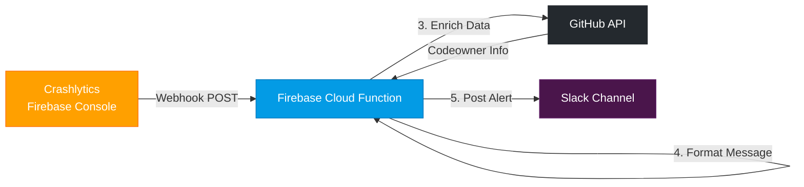
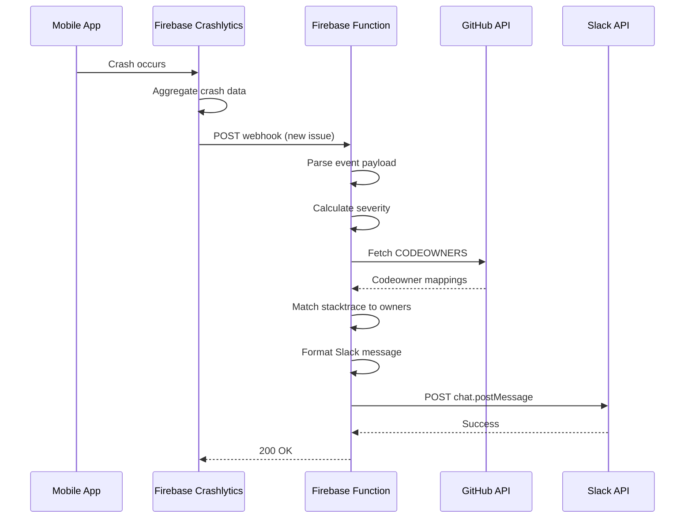

Firebase Crashlytics is the de facto crash reporting solution for mobile apps. Out of the box, it provides email alerts for crash spikes and new issues. But what if you need more control? What if you want to route alerts to Slack, tag codeowners automatically, or filter by severity?

In this post, I'll show you how to build a custom alerting system using Firebase Cloud Functions and Crashlytics webhooks that gives you full control over how your team gets notified about crashes.

## The Problem with Default Alerts

Firebase Crashlytics provides two types of built-in alerts:

1. **Email notifications** for new issues and regressed issues
2. **Velocity alerts** when crash rates spike

These work fine for small teams, but they have limitations:

- **No Slack integration** - emails get buried in busy inboxes
- **No codeowner routing** - all alerts go to the same place
- **Limited customization** - you can't filter by severity or add context
- **No enrichment** - can't add GitHub links, build info, or custom data

## The Solution: Crashlytics Webhooks + Firebase Functions

Firebase Crashlytics supports webhooks that fire when crash events occur. By pointing these webhooks to a Firebase Cloud Function, we can process events however we want.



## The Catch: Blaze Plan Required

Before we dive in, there's an important requirement: **Firebase Crashlytics webhooks require the Blaze (pay-as-you-go) plan**.

Why? Webhooks are outbound network requests from Firebase's infrastructure. The free Spark plan restricts outbound calls to Google-owned services only. Since Crashlytics needs to POST to your Firebase Function URL, you need Blaze.

**Cost reality check:** For typical crash alerting (10-50 alerts/day), you'll pay pennies per month. The Blaze plan includes the same free tier as Spark—you only pay for usage beyond that.

## Prerequisites

1. Firebase project with Crashlytics enabled
2. Firebase Blaze plan (for webhook support)
3. Slack workspace with a bot/app for posting messages
4. GitHub repository (optional, for codeowner tagging)
5. Node.js 20+ installed locally

## Implementation Guide

### Step 1: Setting Up Firebase Functions

First, initialize a Firebase Functions project:

```bash
# Install Firebase CLI
npm install -g firebase-tools

# Login to Firebase
firebase login

# Initialize Firebase project
firebase init functions
```

Select:
- JavaScript (we'll use JS for simplicity)
- ESLint for code quality
- Install dependencies

Your project structure:

```
firebase/
├── .firebaserc           # Firebase project config
├── firebase.json         # Deployment config
└── functions/
    ├── index.js          # Main functions file
    ├── package.json      # Dependencies
    └── util/             # Helper modules
```

Install required dependencies:

```bash
cd functions
npm install axios
```

### Step 2: Creating the Webhook Endpoint

Create the HTTP endpoint in `functions/index.js`:

```javascript
const { onRequest } = require("firebase-functions/v2/https");
const { logger } = require("firebase-functions");

exports.onCrashlyticsWebhook = onRequest(async (req, res) => {
  logger.info("Received Crashlytics webhook request");

  if (req.method !== "POST") {
    logger.warn(`Invalid request method: ${req.method}`);
    res.status(405).send("Method Not Allowed");
    return;
  }

  const payload = req.body;
  const eventType = payload.eventType;

  logger.info(`Processing event: ${eventType}`);

  // Handle different event types
  switch (eventType) {
    case "issue.new":
      await handleNewIssue(payload);
      break;
    case "issue.regressed":
      await handleRegressedIssue(payload);
      break;
    case "issue.velocityAlert":
      await handleVelocityAlert(payload);
      break;
    default:
      logger.info(`Unhandled event type: ${eventType}`);
  }

  res.status(200).send("OK");
});
```

### Step 3: Processing Crash Events

Create `functions/util/crashlyticsHandler.js`:

```javascript
const { logger } = require("firebase-functions");
const { sendSlackMessage } = require("./slackMessaging");
const { fetchCodeowners } = require("./githubApi");

const SEVERITY_LEVELS = {
  CRITICAL: { emoji: "🔴", threshold: 100 },
  HIGH: { emoji: "🟠", threshold: 50 },
  MEDIUM: { emoji: "🟡", threshold: 10 },
  LOW: { emoji: "🟢", threshold: 1 },
};

function getSeverity(crashCount) {
  if (crashCount >= SEVERITY_LEVELS.CRITICAL.threshold) return "CRITICAL";
  if (crashCount >= SEVERITY_LEVELS.HIGH.threshold) return "HIGH";
  if (crashCount >= SEVERITY_LEVELS.MEDIUM.threshold) return "MEDIUM";
  return "LOW";
}

async function handleNewIssue(payload) {
  const { issue, app } = payload.data;

  const crashCount = issue.crashesCount || 1;
  const severity = getSeverity(crashCount);
  const severityInfo = SEVERITY_LEVELS[severity];

  // Try to fetch codeowners based on stack trace
  const codeowners = await fetchCodeownersFromStacktrace(issue.stacktrace);

  const message = {
    text: `${severityInfo.emoji} New Crash in ${app.name}`,
    blocks: [
      {
        type: "header",
        text: {
          type: "plain_text",
          text: `${severityInfo.emoji} New Crash Detected`,
        },
      },
      {
        type: "section",
        fields: [
          {
            type: "mrkdwn",
            text: `*App:*\n${app.name} (${app.platform})`,
          },
          {
            type: "mrkdwn",
            text: `*Severity:*\n${severity} (${crashCount} crashes)`,
          },
          {
            type: "mrkdwn",
            text: `*Issue ID:*\n${issue.id}`,
          },
          {
            type: "mrkdwn",
            text: `*First Seen:*\n${new Date(issue.createdAt).toUTCString()}`,
          },
        ],
      },
    ],
  };

  // Add codeowner mention if found
  if (codeowners.length > 0) {
    message.blocks.push({
      type: "section",
      text: {
        type: "mrkdwn",
        text: `*Codeowners:* ${codeowners.map((o) => `<@${o.slackId}>`).join(" ")}`,
      },
    });
  }

  // Add crash title and link
  message.blocks.push({
    type: "section",
    text: {
      type: "mrkdwn",
      text: `*Crash Title:*\n\`${issue.title}\`\n\n<${issue.url}|View in Crashlytics>`,
    },
  });

  await sendSlackMessage(
    process.env.SLACK_CHANNEL_ID,
    message,
    process.env.SLACK_API_TOKEN
  );

  logger.info(`New issue notification sent: ${issue.id}`);
}

async function handleRegressedIssue(payload) {
  const { issue, app } = payload.data;

  const message = {
    text: `⚠️ Regressed Crash in ${app.name}`,
    blocks: [
      {
        type: "header",
        text: {
          type: "plain_text",
          text: "⚠️ Crash Regression Detected",
        },
      },
      {
        type: "section",
        text: {
          type: "mrkdwn",
          text: `A previously resolved crash has reappeared in *${app.name}*.\n\n*Issue:* \`${issue.title}\`\n<${issue.url}|View in Crashlytics>`,
        },
      },
    ],
  };

  await sendSlackMessage(
    process.env.SLACK_CHANNEL_ID,
    message,
    process.env.SLACK_API_TOKEN
  );

  logger.info(`Regressed issue notification sent: ${issue.id}`);
}

async function handleVelocityAlert(payload) {
  const { issue, app, velocityAlert } = payload.data;

  const message = {
    text: `🚨 Velocity Alert in ${app.name}`,
    blocks: [
      {
        type: "header",
        text: {
          type: "plain_text",
          text: "🚨 Crash Velocity Alert",
        },
      },
      {
        type: "section",
        text: {
          type: "mrkdwn",
          text: `Crash rate has spiked in *${app.name}*!\n\n*Current Rate:* ${velocityAlert.crashRate}%\n*Baseline:* ${velocityAlert.baselineRate}%\n\n*Issue:* \`${issue.title}\`\n<${issue.url}|View in Crashlytics>`,
        },
      },
    ],
  };

  await sendSlackMessage(
    process.env.SLACK_CHANNEL_ID,
    message,
    process.env.SLACK_API_TOKEN
  );

  logger.info(`Velocity alert notification sent: ${issue.id}`);
}

async function fetchCodeownersFromStacktrace(stacktrace) {
  // Parse stack trace to find file paths
  // Match against CODEOWNERS file in GitHub
  // Return list of codeowners with Slack IDs
  return [];
}

module.exports = {
  handleNewIssue,
  handleRegressedIssue,
  handleVelocityAlert,
};
```

### Step 4: Slack Integration

Create `functions/util/slackMessaging.js`:

```javascript
const axios = require("axios");
const { logger } = require("firebase-functions");

async function sendSlackMessage(channel, message, slackApiToken) {
  try {
    const response = await axios.post(
      "https://slack.com/api/chat.postMessage",
      {
        channel: channel,
        ...message,
      },
      {
        headers: {
          Authorization: `Bearer ${slackApiToken}`,
          "Content-Type": "application/json",
        },
      }
    );

    if (!response.data.ok) {
      throw new Error(`Slack API error: ${response.data.error}`);
    }

    return response.data;
  } catch (error) {
    logger.error(`Failed to send Slack message: ${error.message}`);
    throw error;
  }
}

module.exports = { sendSlackMessage };
```

### Step 5: GitHub Codeowner Integration (Optional)

Create `functions/util/githubApi.js`:

```javascript
const axios = require("axios");
const { logger } = require("firebase-functions");

async function fetchCodeowners(owner, repo, githubToken) {
  try {
    const response = await axios.get(
      `https://api.github.com/repos/${owner}/${repo}/contents/.github/CODEOWNERS`,
      {
        headers: {
          Authorization: `Bearer ${githubToken}`,
          Accept: "application/vnd.github.v3.raw",
        },
      }
    );

    return parseCodeowners(response.data);
  } catch (error) {
    logger.error(`Failed to fetch CODEOWNERS: ${error.message}`);
    return [];
  }
}

function parseCodeowners(content) {
  const lines = content.split("\n");
  const codeowners = [];

  for (const line of lines) {
    if (line.startsWith("#") || line.trim() === "") continue;

    const parts = line.split(/\s+/);
    if (parts.length >= 2) {
      const pattern = parts[0];
      const owners = parts.slice(1).filter((o) => o.startsWith("@"));

      codeowners.push({ pattern, owners });
    }
  }

  return codeowners;
}

function matchFileToCodeowner(filePath, codeowners) {
  for (const { pattern, owners } of codeowners) {
    // Simple glob matching - use a proper glob library for production
    if (filePath.includes(pattern.replace("*", ""))) {
      return owners;
    }
  }
  return [];
}

module.exports = { fetchCodeowners, matchFileToCodeowner };
```

### Step 6: Configuring Secrets

Firebase Functions supports environment variables for secrets:

```bash
firebase functions:secrets:set SLACK_API_TOKEN
firebase functions:secrets:set SLACK_CHANNEL_ID
firebase functions:secrets:set GITHUB_TOKEN
```

Update `functions/index.js` to use secrets:

```javascript
const { defineSecret } = require("firebase-functions/params");

const slackApiToken = defineSecret("SLACK_API_TOKEN");
const slackChannelId = defineSecret("SLACK_CHANNEL_ID");
const githubToken = defineSecret("GITHUB_TOKEN");

exports.onCrashlyticsWebhook = onRequest(
  {
    secrets: [slackApiToken, slackChannelId, githubToken],
  },
  async (req, res) => {
    // Handler code here
  }
);
```

### Step 7: Deploying to Firebase

Deploy your function:

```bash
firebase deploy --only functions
```

After deployment, you'll get a URL like:
```
https://us-central1-your-project.cloudfunctions.net/onCrashlyticsWebhook
```

### Step 8: Configuring Crashlytics Webhook

1. Go to [Firebase Console](https://console.firebase.google.com/)
2. Navigate to your project → Crashlytics
3. Go to Settings → Webhooks
4. Add a new webhook:
   - URL: Your Firebase Function URL
   - Events: Select the events you want (new issues, regressed issues, velocity alerts)
5. Save

## Event Flow

Here's how the complete flow works:



## Advanced Features

### Filtering by Severity

Only notify for high-severity crashes:

```javascript
async function handleNewIssue(payload) {
  const { issue } = payload.data;
  const severity = getSeverity(issue.crashesCount);

  // Only alert for HIGH and CRITICAL
  if (!["HIGH", "CRITICAL"].includes(severity)) {
    logger.info(`Skipping low severity issue: ${issue.id}`);
    return;
  }

  // ... send notification
}
```

### Rate Limiting

Prevent spam during crash storms:

```javascript
const processedIssues = new Map();

function shouldProcess(issueId, cooldownMinutes = 30) {
  const lastProcessed = processedIssues.get(issueId);
  if (!lastProcessed) return true;

  const elapsed = Date.now() - lastProcessed;
  return elapsed > cooldownMinutes * 60 * 1000;
}

async function handleNewIssue(payload) {
  const { issue } = payload.data;

  if (!shouldProcess(issue.id)) {
    logger.info(`Rate limited issue: ${issue.id}`);
    return;
  }

  processedIssues.set(issue.id, Date.now());
  // ... process issue
}
```

### Multi-Channel Routing

Route alerts to different channels based on app or severity:

```javascript
function getChannelForAlert(app, severity) {
  const channelMap = {
    "production-app": {
      CRITICAL: "alerts-critical",
      HIGH: "alerts-high",
      default: "alerts-low",
    },
    "staging-app": {
      default: "alerts-staging",
    },
  };

  const appChannels = channelMap[app.id] || channelMap["default"];
  return appChannels[severity] || appChannels.default;
}
```

## Cost Considerations

Firebase Functions pricing:
- 2 million invocations/month free
- After that: ~$0.40 per million invocations
- Outbound networking: $0.12/GB

For typical crash alerting (20-50 alerts/day), you'll stay well within the free tier.

## What's Next

In [Part 2](/app-store-connect-webhooks-firebase-functions/), we'll extend this infrastructure to handle Apple's App Store Connect webhooks for iOS release notifications—using the same Firebase Functions setup to automate release status tracking.

---

💡 **Pattern to Remember:** Webhook systems follow a consistent pattern: receive payload → parse event → enrich data → format notification → deliver. Once you've built one webhook handler, you can apply the same pattern to GitHub webhooks, Stripe webhooks, and most other providers.

---

Have questions or improvements? I'd love to hear how you're using Crashlytics webhooks in your projects!
