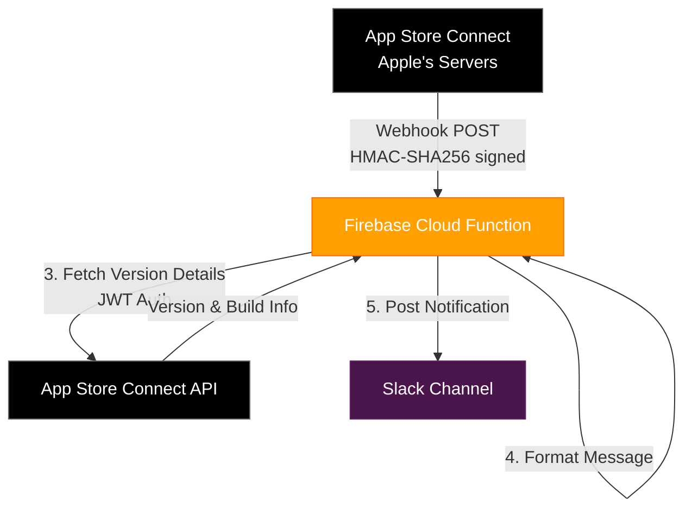
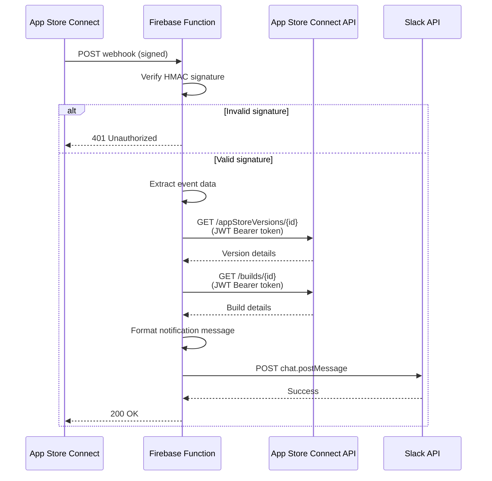
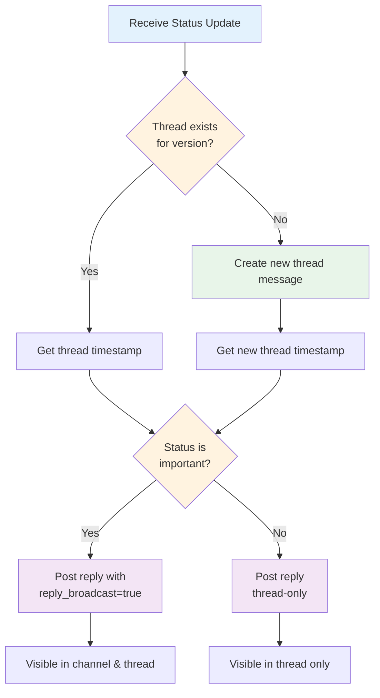

As iOS release engineers, one of our most repetitive tasks is manually checking App Store Connect for status updates during the app review and release process. Is our build still waiting for review? Has it been approved? Is it live to customers?

For years, the only options were either:
1. Manually refreshing App Store Connect every few hours
2. Using App Store Connect's email notifications (which often get lost in busy inboxes)
3. Building a polling system using the App Store Connect API

In late 2024, Apple introduced a game-changer: **webhooks for App Store Connect**. Instead of constantly polling their API, you can now receive real-time push notifications when your app's status changes.

In this post, I'll walk you through how we built an automated release notification system using Apple's webhooks and Firebase Cloud Functions that posts status updates directly to Slack. The architecture is serverless, secure, and easy to maintain.

**Prerequisites:** This post builds on the Firebase Functions infrastructure from [Part 1: Custom Firebase Crashlytics Alerts](/custom-firebase-crashlytics-alerts-firebase-functions/). If you haven't set up Firebase Functions yet, start there first.

## The Problem with Polling

Before webhooks, if you wanted automated notifications, you'd need to build a polling system:

```javascript
// The old way: expensive and inefficient
setInterval(async () => {
  const status = await fetchAppStoreConnectAPI();
  if (status !== previousStatus) {
    sendNotification(status);
    previousStatus = status;
  }
}, 5 * 60 * 1000); // Poll every 5 minutes
```

This approach has several problems:
- **Latency**: You only discover changes every N minutes
- **Cost**: You're making API calls even when nothing changes
- **Rate limiting**: Frequent polling can hit API rate limits
- **Infrastructure**: You need always-running infrastructure to poll

Webhooks solve all of these problems by pushing notifications to you the moment something changes.

## Architecture Overview

Here's the high-level architecture we implemented:



### Why Firebase Functions?

- **Serverless**: No infrastructure to maintain
- **Auto-scaling**: Handles traffic spikes automatically
- **Cost-effective**: Pay only for actual invocations
- **Easy deployment**: Simple CI/CD integration
- **Environment secrets**: Built-in secret management

## Prerequisites

Before we start, you'll need:

1. Apple Developer Account with access to App Store Connect
2. App Store Connect API key with appropriate permissions
3. Firebase project (free tier works fine, but Blaze required for webhooks)
4. Slack workspace with a bot/app for posting messages
5. Node.js 20+ installed locally

## Implementation Guide

### Step 1: Setting Up Firebase Functions

If you followed [Part 1](/custom-firebase-crashlytics-alerts-firebase-functions/), you already have Firebase Functions set up. If not, initialize a new project:

```bash
# Install Firebase CLI
npm install -g firebase-tools

# Login to Firebase
firebase login

# Initialize Firebase project
firebase init functions
```

Select:
- JavaScript or TypeScript (we'll use JavaScript)
- ESLint for code quality
- Install dependencies

Your project structure should look like:

```
firebase/
├── .firebaserc           # Firebase project config
├── firebase.json         # Deployment config
└── functions/
    ├── index.js          # Main functions file
    ├── package.json      # Dependencies
    └── util/             # Helper modules
```

Install required dependencies:

```bash
cd functions
npm install jsonwebtoken axios
```

### Step 2: Creating the Webhook Endpoint

Let's create the HTTP endpoint that Apple will call. In `functions/index.js`:

```javascript
const { onRequest } = require("firebase-functions/v2/https");
const { logger } = require("firebase-functions");

exports.onAppStoreConnectWebhook = onRequest(async (req, res) => {
  logger.info("Received Apple App Store Connect webhook request");

  // Only accept POST requests
  if (req.method !== "POST") {
    logger.warn(`Invalid request method: ${req.method}`);
    res.status(405).send("Method Not Allowed");
    return;
  }

  // Get required environment variables
  const APPLE_WEBHOOK_SECRET = process.env.APPLE_WEBHOOK_SECRET;

  if (!APPLE_WEBHOOK_SECRET) {
    logger.error("APPLE_WEBHOOK_SECRET is not configured");
    res.status(500).send("Server configuration error");
    return;
  }

  // Verify webhook signature
  const signature = req.headers["x-apple-signature"];
  if (!signature) {
    logger.error("Missing X-Apple-Signature header");
    res.status(401).send("Unauthorized: Missing signature");
    return;
  }

  const rawBody = req.rawBody ? req.rawBody.toString("utf8") : JSON.stringify(req.body);

  if (!verifyAppleWebhookSignature(rawBody, signature, APPLE_WEBHOOK_SECRET)) {
    logger.error("Invalid webhook signature");
    res.status(401).send("Unauthorized: Invalid signature");
    return;
  }

  logger.info("Webhook signature verified successfully");

  // Process the webhook payload
  const payload = req.body;
  const eventData = payload.data;
  const eventType = eventData.type;

  // Handle app version status updates
  if (eventType === "appStoreVersionAppVersionStateUpdated") {
    await handleStatusUpdate(eventData);
  }

  res.status(200).send("OK");
});
```

💡 **Key Insight**: Without signature verification, anyone could send fake webhook requests to your endpoint. Apple signs each webhook with HMAC-SHA256, creating a cryptographic guarantee that the request came from Apple's servers. This is critical for security—you're trusting these webhooks to trigger production notifications.

### Step 3: Implementing Webhook Signature Verification

Create `functions/util/appStoreConnect.js`:

```javascript
const crypto = require("crypto");
const { logger } = require("firebase-functions");

function verifyAppleWebhookSignature(rawBody, signature, secret) {
  if (!signature || !secret) {
    logger.error("Missing signature or secret for verification");
    return false;
  }

  try {
    // Apple sends: "hmacsha256=<hex_hash>"
    const signatureHash = signature.startsWith("hmacsha256=")
      ? signature.substring(11)
      : signature;

    // Compute expected signature
    const computedSignature = crypto
      .createHmac("sha256", secret)
      .update(rawBody, "utf8")
      .digest("hex");

    // Use timing-safe comparison to prevent timing attacks
    return crypto.timingSafeEqual(
      Buffer.from(signatureHash, "hex"),
      Buffer.from(computedSignature, "hex")
    );
  } catch (error) {
    logger.error(`Failed to verify webhook signature: ${error.message}`);
    return false;
  }
}

module.exports = { verifyAppleWebhookSignature };
```

Here's the sequence of webhook processing:



### Step 4: Authenticating with App Store Connect API

When a webhook arrives, it contains minimal information—just the event type and a resource ID. To get useful details (like version numbers and build versions), we need to call the App Store Connect API.

Apple uses JWT authentication with ES256 signing. Add this to `util/appStoreConnect.js`:

```javascript
const jwt = require("jsonwebtoken");

// Apple allows tokens up to 20 minutes, but shorter is better
const TOKEN_EXPIRATION_SECONDS = 1 * 60; // 1 minute

function generateAppStoreConnectToken(keyId, issuerId, privateKey) {
  const issuedAt = Math.floor(Date.now() / 1000);
  const expirationTime = issuedAt + TOKEN_EXPIRATION_SECONDS;

  const header = {
    alg: "ES256",
    kid: keyId,
    typ: "JWT",
  };

  const payload = {
    iss: issuerId,
    iat: issuedAt,
    exp: expirationTime,
    aud: "appstoreconnect-v1",
  };

  try {
    return jwt.sign(payload, privateKey, { header });
  } catch (err) {
    throw new Error(`Failed to generate token: ${err.message}`);
  }
}

module.exports = {
  verifyAppleWebhookSignature,
  generateAppStoreConnectToken,
};
```

💡 **Key Insight**: ES256 uses elliptic curve cryptography (ECDSA), which is more secure than HMAC-based HS256 for API authentication. Apple provides you with a `.p8` private key file—this asymmetric approach means Apple can verify your signatures with the public key without you ever sharing the private key.

### Step 5: Fetching App Version Details

Now we can fetch detailed information from the App Store Connect API:

```javascript
const axios = require("axios");
const { logger } = require("firebase-functions");

async function fetchAppVersionDetails(versionUrl, keyId, issuerId, privateKey) {
  try {
    const token = generateAppStoreConnectToken(keyId, issuerId, privateKey);

    // Fetch version details
    const response = await axios.get(versionUrl, {
      headers: {
        Authorization: `Bearer ${token}`,
        "Content-Type": "application/json",
      },
    });

    const versionData = response.data.data;

    // Also fetch build details if available
    const buildUrl = versionData.relationships?.build?.links?.related;

    if (buildUrl) {
      const buildResponse = await axios.get(buildUrl, {
        headers: {
          Authorization: `Bearer ${token}`,
          "Content-Type": "application/json",
        },
      });

      // Attach build version to version data
      versionData.buildVersion = buildResponse.data.data.attributes.version;
    }

    return versionData;
  } catch (error) {
    logger.error(`Failed to fetch version details: ${error.message}`);
    return null;
  }
}

module.exports = {
  verifyAppleWebhookSignature,
  generateAppStoreConnectToken,
  fetchAppVersionDetails,
};
```

### Step 6: Handling Status Updates

Different statuses matter at different stages of the release process. Let's create status handling logic in `util/appStoreStatus.js`:

```javascript
const NOTIFIABLE_STATUSES = {
  READY_FOR_REVIEW: "ready for review",
  WAITING_FOR_REVIEW: "waiting for review",
  IN_REVIEW: "in review",
  PENDING_DEVELOPER_RELEASE: "pending developer release",
  READY_FOR_DISTRIBUTION: "ready for distribution",
  REJECTED: "rejected",
  METADATA_REJECTED: "metadata rejected",
  DEVELOPER_REJECTED: "developer rejected",
};

function isNotifiableStatus(status) {
  return status in NOTIFIABLE_STATUSES;
}

function humanizeAppStoreStatus(status) {
  return NOTIFIABLE_STATUSES[status] || status;
}

function getStatusType(status) {
  const errorStatuses = ["REJECTED", "METADATA_REJECTED", "DEVELOPER_REJECTED"];
  return errorStatuses.includes(status) ? "error" : "success";
}

module.exports = {
  isNotifiableStatus,
  humanizeAppStoreStatus,
  getStatusType,
};
```

### Step 7: Posting to Slack

Finally, let's send formatted notifications to Slack. Create `util/slackMessaging.js`:

```javascript
const axios = require("axios");
const { logger } = require("firebase-functions");

async function sendSlackMessage(channel, text, slackApiToken) {
  const response = await axios.post(
    "https://slack.com/api/chat.postMessage",
    {
      channel: channel,
      text: text,
    },
    {
      headers: {
        Authorization: `Bearer ${slackApiToken}`,
        "Content-Type": "application/json",
      },
    }
  );

  if (!response.data.ok) {
    throw new Error(`Slack API error: ${response.data.error}`);
  }

  return response.data;
}

module.exports = { sendSlackMessage };
```

### Step 8: Putting It All Together

Update the main handler in `index.js`:

```javascript
const { verifyAppleWebhookSignature, fetchAppVersionDetails } = require("./util/appStoreConnect");
const { isNotifiableStatus, humanizeAppStoreStatus } = require("./util/appStoreStatus");
const { sendSlackMessage } = require("./util/slackMessaging");

async function handleStatusUpdate(eventData) {
  const newStatus = eventData.attributes?.newValue;

  if (!isNotifiableStatus(newStatus)) {
    logger.info(`Status "${newStatus}" is not notifiable, skipping`);
    return;
  }

  // Fetch version details
  const versionUrl = eventData.relationships?.instance?.links?.self;
  const versionDetails = await fetchAppVersionDetails(
    versionUrl,
    process.env.APP_STORE_CONNECT_KEY_ID,
    process.env.APP_STORE_CONNECT_ISSUER_ID,
    process.env.APP_STORE_CONNECT_PRIVATE_KEY
  );

  const versionString = versionDetails?.attributes?.versionString || "Unknown";
  const buildVersion = versionDetails?.buildVersion || "Unknown";
  const statusLabel = humanizeAppStoreStatus(newStatus);

  // Format message
  const message = `📱 Build ${buildVersion} (v${versionString}) is now *${statusLabel}*`;

  // Send to Slack
  await sendSlackMessage(
    process.env.SLACK_CHANNEL_ID,
    message,
    process.env.SLACK_API_TOKEN
  );

  logger.info(`Notification sent for status: ${newStatus}`);
}
```

### Step 9: Configuring Secrets

Firebase Functions supports environment variables for secrets. Set them up:

```bash
firebase functions:secrets:set APPLE_WEBHOOK_SECRET
firebase functions:secrets:set APP_STORE_CONNECT_KEY_ID
firebase functions:secrets:set APP_STORE_CONNECT_ISSUER_ID
firebase functions:secrets:set APP_STORE_CONNECT_PRIVATE_KEY
firebase functions:secrets:set SLACK_API_TOKEN
firebase functions:secrets:set SLACK_CHANNEL_ID
```

### Step 10: Deploying to Firebase

Deploy your function:

```bash
firebase deploy --only functions
```

After deployment, you'll get a URL like:
```
https://us-central1-your-project.cloudfunctions.net/onAppStoreConnectWebhook
```

### Step 11: Configuring Apple's Webhook

1. Go to https://appstoreconnect.apple.com/
2. Navigate to Users and Access → Integrations → Webhooks
3. Click + to add a new webhook
4. Configure:
   - URL: Your Firebase Function URL
   - Secret: The same secret you set in `APPLE_WEBHOOK_SECRET`
   - Events: Select App Store Version State Changed
5. Save and test the webhook

💡 **Testing Tip**: Apple provides a "Send Test" button that sends a sample webhook. Use this to verify your function is working before going live. Check Firebase Functions logs with `firebase functions:log` to debug any issues.

## Advanced Features

### Threading Slack Messages by Version

Instead of spamming a channel with separate messages for each status change, you can group updates by version using Slack threads:

```javascript
async function findOrCreateThread(channel, versionString, slackApiToken) {
  // Search recent messages for existing thread
  const historyResponse = await axios.get(
    "https://slack.com/api/conversations.history",
    {
      params: { channel, limit: 100 },
      headers: { Authorization: `Bearer ${slackApiToken}` },
    }
  );

  const pattern = new RegExp(`v${versionString.replace(/\./g, "\\.")}`);
  const existingThread = historyResponse.data.messages?.find((msg) =>
    pattern.test(msg.text)
  );

  if (existingThread) {
    return existingThread.ts; // Thread timestamp
  }

  // Create new thread
  const postResponse = await axios.post(
    "https://slack.com/api/chat.postMessage",
    {
      channel,
      text: `📱 Version ${versionString} Release Updates`,
    },
    {
      headers: { Authorization: `Bearer ${slackApiToken}` },
    }
  );

  return postResponse.data.ts;
}

// Then post status updates as thread replies
await axios.post(
  "https://slack.com/api/chat.postMessage",
  {
    channel: SLACK_CHANNEL_ID,
    thread_ts: threadTs,
    text: statusMessage,
    reply_broadcast: shouldBroadcastToChannel(newStatus), // Broadcast important updates
  },
  { headers: { Authorization: `Bearer ${slackApiToken}` } }
);
```

Here's how the threading logic works:



### Detecting Phased Releases

Check if a release is using phased rollout:

```javascript
async function fetchPhasedReleaseStatus(versionId, keyId, issuerId, privateKey) {
  const token = generateAppStoreConnectToken(keyId, issuerId, privateKey);
  const versionUrl = `https://api.appstoreconnect.apple.com/v1/appStoreVersions/${versionId}`;

  const versionResponse = await axios.get(versionUrl, {
    headers: { Authorization: `Bearer ${token}` },
  });

  const phasedReleaseUrl = versionResponse.data.data.relationships
    ?.appStoreVersionPhasedRelease?.links?.related;

  if (!phasedReleaseUrl) {
    return { isPhased: false };
  }

  const phasedResponse = await axios.get(phasedReleaseUrl, {
    headers: { Authorization: `Bearer ${token}` },
  });

  // If data exists, phased release is active
  return {
    isPhased: phasedResponse.data.data !== null,
  };
}
```

## Best Practices

### 1. Always Return 200 to Apple

Even if your processing fails internally, always return 200 OK to Apple. Otherwise, Apple will retry the webhook, potentially causing duplicate notifications:

```javascript
try {
  await handleStatusUpdate(eventData);
  res.status(200).send("OK");
} catch (error) {
  logger.error(`Processing failed: ${error.message}`);
  // Still return 200 to acknowledge receipt
  res.status(200).send("OK");
}
```

### 2. Implement Idempotency

Webhooks can be delivered more than once. Store processed webhook IDs to prevent duplicates:

```javascript
const processedWebhooks = new Set(); // In production, use a database

if (processedWebhooks.has(webhookId)) {
  logger.info(`Webhook ${webhookId} already processed, skipping`);
  return;
}

processedWebhooks.add(webhookId);
await handleStatusUpdate(eventData);
```

### 3. Use Timing-Safe Comparison

Always use `crypto.timingSafeEqual()` for signature verification to prevent timing attacks. Standard string comparison can leak information about the secret through response timing.

### 4. Keep JWT Tokens Short-Lived

Apple allows JWT tokens up to 20 minutes, but shorter is better (we use 1 minute). This limits the blast radius if a token is somehow compromised.

### 5. Filter Status Updates

Not all status changes are interesting. Filter to only the statuses your team cares about to reduce noise.

## Monitoring and Debugging

### View Firebase Logs

```bash
firebase functions:log --only onAppStoreConnectWebhook
```

### Common Issues

**Signature verification fails:**
- Check that `APPLE_WEBHOOK_SECRET` matches what's configured in App Store Connect
- Ensure you're verifying the raw request body, not the parsed JSON

**API calls fail with 401:**
- Verify your App Store Connect API credentials
- Check that the `.p8` private key is properly formatted (with newlines preserved)
- Ensure the key has the necessary permissions in App Store Connect

**No webhooks received:**
- Verify the webhook is enabled in App Store Connect
- Check that your Firebase Function is publicly accessible
- Test with Apple's "Send Test" button

## Cost Considerations

Firebase Functions pricing:
- 2 million invocations/month free
- After that: ~$0.40 per million invocations
- Outbound networking: $0.12/GB

For typical iOS app release workflows (5-10 status changes per release, 2-4 releases/month), you'll likely stay well within the free tier.

## Conclusion

Apple's App Store Connect webhooks, combined with serverless functions, provide a powerful way to automate release notifications without maintaining infrastructure. This architecture is:

- **Reliable**: Firebase's managed infrastructure handles scaling and availability
- **Secure**: Cryptographic signature verification ensures authenticity
- **Cost-effective**: Serverless pricing means you only pay for what you use
- **Maintainable**: Simple codebase with clear separation of concerns

The complete implementation consists of just a few hundred lines of code but saves hours of manual status checking and provides real-time visibility into your release process.

### Next Steps

Consider extending this system to:
- Track release metrics (time in review, approval rates)
- Integrate with incident management tools
- Send notifications to multiple channels (email, PagerDuty, etc.)
- Add custom rules for specific status transitions (e.g., auto-cancel if metadata rejected)

The webhook architecture is flexible enough to support whatever workflows make sense for your team.

---

💡 **Pattern to Remember**: Webhook systems follow a consistent pattern: verify signature → extract event data → enrich with API calls → format notification → deliver to destination. This same pattern works for GitHub webhooks, Stripe webhooks, and most other webhook providers. Master it once, apply it everywhere.

---

Have questions or improvements? I'd love to hear how you're using App Store Connect webhooks in your release process!
